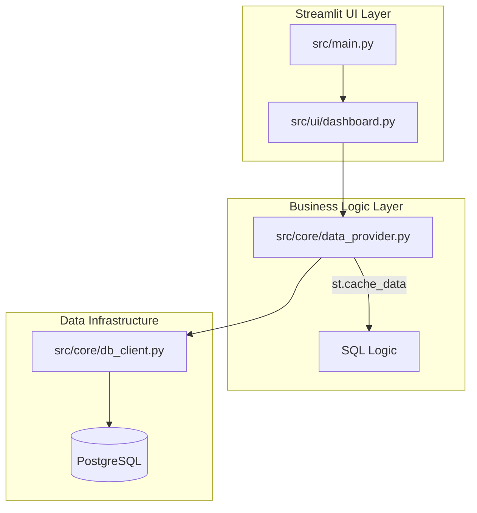

# Olist E-Commerce Analytics: From Data to Strategy 📊

A professional Streamlit-powered analytics application that transforms raw transactional data from Brazilian e-commerce into interactive business intelligence.

[](https://www.python.org/)
[](https://streamlit.io/)
[](https://plotly.com/)
[](https://www.postgresql.org/)

---

## 🚀 Executive Summary (STAR Method)

- **Situation:** Olist operates a massive marketplace in Brazil, managing high-volume transactions, logistics, and customer feedback. Stakeholders lacked a unified, interactive tool to visualize performance drivers and identify operational risks.
- **Task:** Transition from static, script-based analysis to a professional web-based dashboard that provides real-time KPIs, interactive visualizations, and dynamic business recommendations.
- **Action:** Developed a layered architecture (PostgreSQL -> Core Data Layer -> Streamlit UI). Refactored SQL logic into a cached data provider and implemented interactive charts using Plotly Express for drill-down capabilities.
- **Result:** Delivered a decision-ready executive dashboard that highlights revenue peaks, categories with the highest growth, and regional logistics bottlenecks, enabling data-driven strategic planning for the C-suite.

---

## ⚙️ Quick Start

### 1. Prerequisite Setup
Ensure your local environment is configured with PostgreSQL and the Olist dataset:
```bash
# Clone the repo and install dependencies
pip install -r requirements.txt

# Configure your database env
cp analysis/.env.example analysis/.env
```

### 2. Seed Data
If you haven't run the pipeline yet, initialize the database:
```bash
./scripts/run_pipeline.sh
```

### 3. One-Click Launch
Start the web application directly from the root:
```bash
python start_analysis.py
```

---

## 🏛 Technical Architecture

The project follows a strict three-tier architecture to ensure maintainability and separation of concerns:



- **Persistence Layer**: Raw data ingestion into PostgreSQL.
- **Logic Layer**: Python-based data provider utilizing `st.cache_data` to minimize DB overhead.
- **Presentation Layer**: Modular Streamlit components and Plotly charts.

---

## 🛠 Features

- **Dynamic KPI Cards**: Instant tracking of Revenue, AOV, and Order Volume with period-over-period deltas.
- **Interactive Visualizations**: Zoomable revenue trends and regional GMV distribution maps.
- **Executive Summary**: Real-time business insights generated via dynamic Python logic.
- **One-Click Deployment**: Simplified launch sequence for developers and analysts.

---

## ✉️ Author
**Andrew Shwarts**  
[LinkedIn](https://linkedin.com/in/andrewshwarts) | [Portfolio](https://example.com)